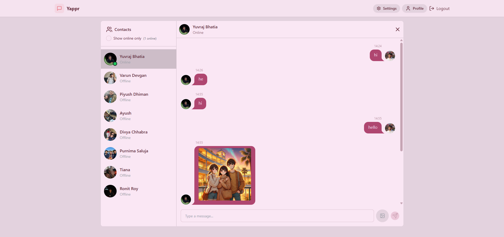
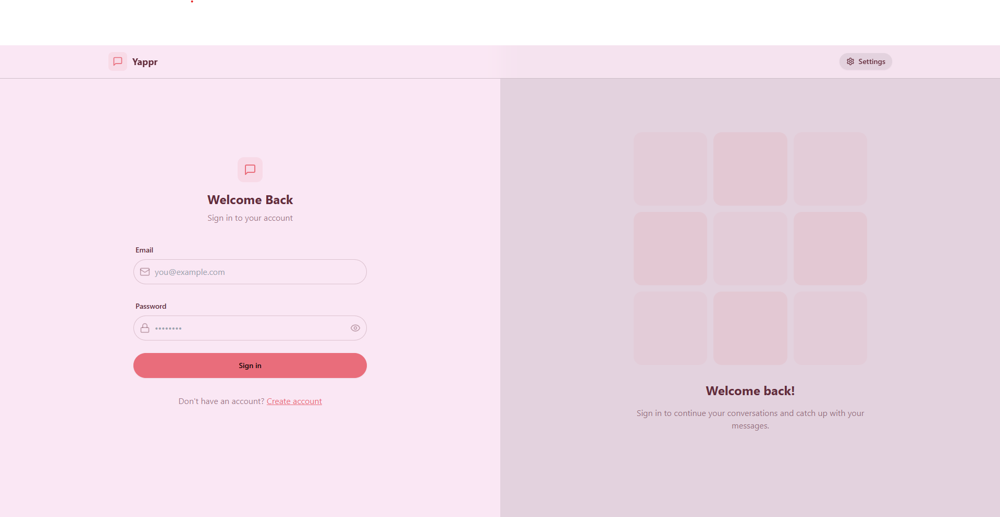
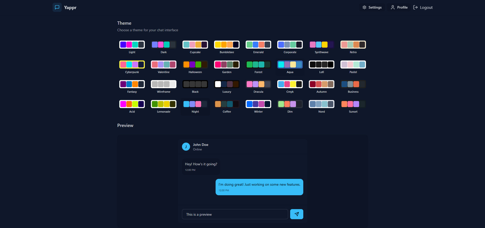

# Yappr 💬

Yappr is a full-stack real-time chat application built with the **MERN** stack, enhanced with **Socket.io** for real-time communication, styled using **TailwindCSS** and **DaisyUI**, and powered by modern state management using **Zustand**.

---

## 🚀 Features

- 🌟 **MERN Stack** (MongoDB, Express.js, React.js, Node.js)
- 🎃 **JWT-based Authentication & Authorization**
- 👾 **Real-time Messaging** with Socket.io
- 🚦 **Online User Status** Indication
- 🗂️ **Global State Management** with Zustand
- 🛠️ **Robust Error Handling** (Server + Client)
- ☁️ **Cloudinary Integration** for image uploads
- 🧪 **Environment-Based Configuration**
- 🚀 **Production-ready Deployment**

---

## 🛠️ Tech Stack

- **Frontend**: React.js, TailwindCSS, DaisyUI
- **Backend**: Node.js, Express.js
- **Database**: MongoDB (Mongoose)
- **Real-time**: Socket.io
- **State Management**: Zustand
- **Media Storage**: Cloudinary

---

## Installation

1.  Clone the repository:

    ```sh
    git clone https://github.com/ankushchhabra02/yappr.git
    cd yappr
    ```

2.  Install dependencies:

    ```sh
    npm install
    ```

3.  Set up environment variables:
    Create a `.env.local` file in the root directory and add:

    ```ini
    MONGODB_URI=your_mongodb_connection_string
    PORT=5001
    JWT_SECRET=your_jwt_secret_key

    CLOUDINARY_CLOUD_NAME=your_cloudinary_cloud_name
    CLOUDINARY_API_KEY=your_cloudinary_api_key
    CLOUDINARY_API_SECRET=your_cloudinary_api_secret

    NODE_ENV=development
    ```

4.  Build the app

    ```sh
    npm run build
    ```

5.  start the app

    ```sh
    npm run start
    ```

## Demo

Here’s a preview of Yappr in action:

1. Home Page
   

2. Login Page
   

3. Theme Page
   
